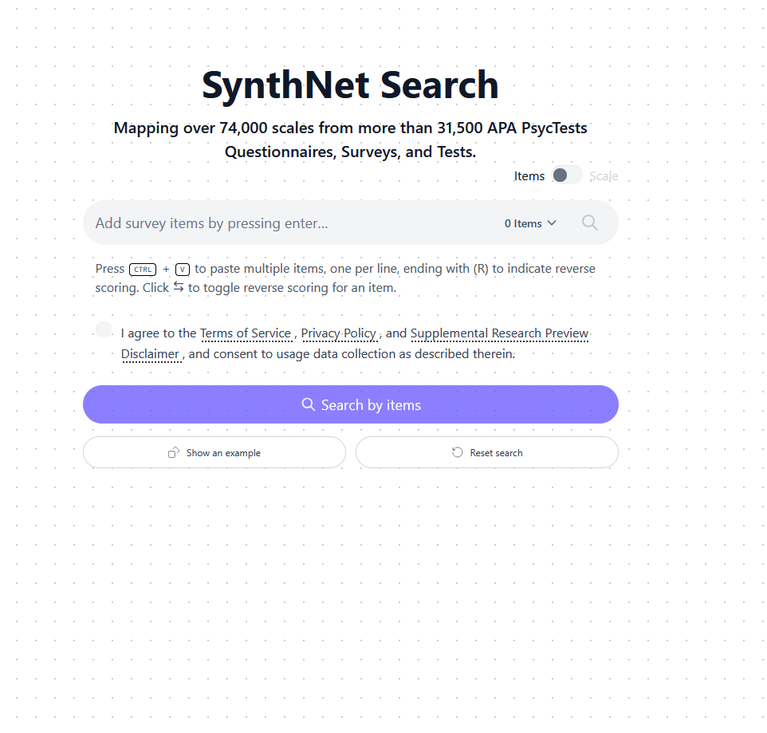

# The Synthetic Nomological Net

This repository contains code and resources related to the Synthetic Nomological Net (SynthNet) project. The APp is currently hostet on Huggingface Spaces at [https://huggingface.co/spaces/magnolia-psychometrics/synth-net](https://huggingface.co/spaces/magnolia-psychometrics/synth-net). 

`document_extractor` is a module for extracting structured data from unstructured documents using language models.
`generate_search_data` contains scripts for generating the SynthNet search dataset.
`analyses/corpus_coverage` measures how much of PsycTests (usage-weighted) the search corpus covers and holds the pipeline that extends the corpus from three further item-text sources (web scale hunt, SemanticNet, Larsen/aligns).
`analyses/scale_pooling` evaluates how to pool item embeddings into scale vectors when items are reverse-keyed, and how robust that is to wrong keying.

Cite as:
> Hommel, B. E., Külpmann, A., & Arslan, R. C. (2025). The Synthetic Nomological Net: A search engine to identify conceptual overlap in measures in the behavioral sciences. Manuscript in preparation. 