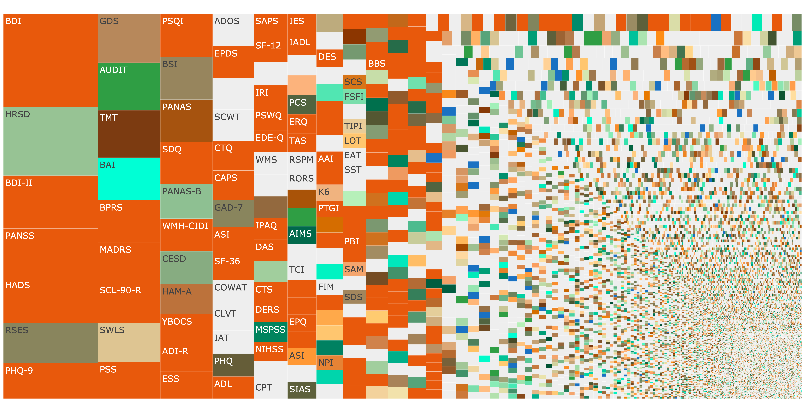

# SynthNet corpus coverage and corpus extension

How much of the APA PsycTests universe (weighted by how often each test is used
in the PsycInfo literature) does the SynthNet search corpus cover, and how far
do three additional item-text sources push that coverage?

PsycTests has 71,692 records; PsycInfo usage counts exist for the 31,144 that
have been cited at least once, and the usage-weighted share is over those.
"Overlapping" counts every record a source can cover, whether or not another
source already covers it; "incremental" counts what each source adds on top of
the tiers before it (synthnet > hunt > semanticnet > aligns), which is what the
treemap colours. From `coverage_by_source.R`:

| Source | Records (of 71,692), overlapping | Usage share, overlapping | Records, incremental | Usage share, incremental |
|---|---|---|---|---|
| synthnet: Björn's extractions (`raw-extractions-exploded.parquet`, bucket `scaled`) | 32,223 (44.9 %) | 37.1 % | 32,223 | 37.1 % |
| hunt: web scale hunt for the 156 most-used missing instruments (`scale_hunt_*`) | 132 | 28.5 % | 132 | 28.5 % |
| semanticnet: SemanticNet item database (Rosenbusch et al.), `semanticnet_*` | 476 | 13.3 % | 186 | 0.9 % |
| aligns: Larsen/aligns corpus from public repositories (NIH HEAL, Catalogue of Mental Health Measures, SOBC, Stress Measurement Network, PROMIS), `aligns_ingest.R` | 125 | 13.7 % | 47 | 1.5 % |
| any source | 32,588 (45.5 %) | 68.0 % | 32,588 | 68.0 % |

SemanticNet and aligns mostly re-cover what SynthNet and the hunt already
have; their incremental contribution is small, their overlapping coverage is
not. The overlapping match sets are `data/processed/semanticnet_matches_all.csv`
and `aligns_matches_all.csv` (written by the ingests before their
"not yet covered" filter); `data/processed/coverage_by_source.csv` holds the table.



`figures/treemap_coverage.png` shows SynthNet-only coverage, `figures/treemap_coverage_sources.png`
colours the four tiers, `figures/treemap_coverage_all.png` pools them. Tiles are
sized by PsycInfo usage counts (our own scrape, already published).

## Pipeline

Run everything from this directory. Order matters because each ingest reads
the coverage of the tiers before it:

```
Rscript scale_hunt_assemble.R      # hunt JSON -> data/restricted/scale-hunt-extractions-exploded.parquet
python3 semanticnet_clean.py       # repair the raw SemanticNet export -> data/semanticnet/items_clean.csv
python3 semanticnet_match.py       # re-key data/semanticnet/scale_matches.csv to the repaired names
Rscript semanticnet_ingest.R       # -> data/semanticnet/semanticnet-extractions-exploded.parquet
Rscript aligns_ingest.R            # -> data/aligns/aligns-extractions-exploded.parquet
Rscript dedupe_fill_tiers.R        # content-dedupe the three fill parquets IN PLACE, writes alias table
Rscript scale_hunt_treemap.R       # incremental coverage table + figures/treemap_coverage_{sources,all}.{png,html}
Rscript coverage_by_source.R       # overlapping vs incremental coverage per source, both denominators
Rscript -e "rmarkdown::render('coverage_synthnet.Rmd')"   # full report incl. figures/treemap_coverage.png
Rscript -e "rmarkdown::render('descriptives_for_revision.Rmd')"   # items per instrument / per scale -> data/processed/descriptives_items_per_scale.csv
```

`scale_hunt_check.py <workflow_output.json>` is the deterministic verbatim
checker for hunt extractions against the archived source PDFs (needs the
`pdf_inspector` package and the PDFs in `data/restricted/pdfs/`).

`larsen/larsen_data_cleaning.Rmd` is the students' cleaning notebook that turns
the raw aligns corpus into `data/aligns/larsen_instruments.csv` (shipped here).

### What each script does

- `scale_hunt_assemble.R`: converts the agent workflow outputs of the web scale
  hunt (`data/restricted/batch*.json`) into the exploded-item parquet schema
  used by SynthNet, adding provenance columns.
- `semanticnet_clean.py`: the upstream SemanticNet export `items(in).csv` is
  malformed CSV in four ways (`\r\r\n` line ends with optional `;;` suffix,
  quotes closed and reopened around embedded newlines, double-wrapped records
  that glue citations onto item text, cp1252 encoding). The script rebuilds a
  clean CSV deterministically.
- `semanticnet_match.py`: refreshes the SemanticNet scale-name to PsycTests DOI
  mapping so the join in the ingest is exact (previously 126 of 705 matched
  scales were silently dropped by a punctuation mismatch).
- `semanticnet_ingest.R`, `aligns_ingest.R`: fill PsycTests records that no
  earlier tier covers. Gate: distinctive name match and item count within 25 %
  of the PsycTests expectation. Both source `lang_exclude.R`, which keeps
  English items from being filed under translation records ("X--chinese
  version"), and read the hunt coverage live from the hunt parquet.
- `dedupe_fill_tiers.R`: drops fill records whose normalised item set has
  Jaccard >= .8 with a record already in the corpus (containment-only pairs such
  as PHQ-9 inside PHQ stay). Aliases (dropped DOI to kept DOI) go to
  `data/processed/fill_tier_dedupe_aliases.csv`; aliased DOIs still count as
  covered in the treemap. Destructive: regenerate the parquets before re-running.
- `coverage_by_source.R`: the coverage table above (overlapping and incremental, record and usage denominators).
- `scale_hunt_treemap.R`: incremental coverage by tier and the treemaps.
  `treemap_functions.R` holds the plotly treemap helper (vendored from
  `rubenarslan/construct_proliferation`), `data/palette.rds` the colours.
- `coverage_synthnet.Rmd`: the full report (coverage by test count, usage,
  instrument type and year; top missing tests; treemaps).
- `descriptives_for_revision.Rmd`: corpus descriptives for the manuscript revision,
  currently items per instrument and per scale node (own items, and including
  subscales) by tier; table in `data/processed/descriptives_items_per_scale.csv`.

## Inputs

Data policy: nothing from the APA PsycTests database other than test name,
DOI and link is committed. The tables below were stripped of PsycTests
authors, citations, instrument types, expected item counts, factor structure,
commercial/fee/permission fields and accession numbers; the ingest scripts
write only the stripped columns, and full versions are regenerated locally by
the pipeline. PsycInfo usage counts (our own scrape, already published) are
kept.

Committed (no item text, no PsycTests fields beyond name/DOI/link):

- `data/processed/scale_hunt_targets.csv`: the 156 hunt targets (name, acronym,
  alternate names, DOI, website, usage count); `scale_hunt_batches/*.json` the per-batch agent task lists;
  `scale_hunt_pilot*.csv`, `scale_hunt_check_report.csv` the pilot and checker
  reports.
- `data/processed/{semanticnet,aligns}_ingested.csv`: which PsycTests records
  each tier filled; `{semanticnet,aligns}_matches_all.csv` the full gated match
  sets regardless of prior coverage; `coverage_by_source.csv` the coverage table; `semanticnet_fillable_beyond_targets.csv` the wider
  potential; `fill_tier_dedupe_aliases.csv` the dedupe aliases;
  `larsen_psyctests_matches.csv` the aligns name to DOI mapping;
  `synthnet_top200_missing_scaled.csv` the most-used missing tests.
- `data/semanticnet/scale_matches.csv`: SemanticNet scale names to PsycTests DOIs.
- `data/aligns/larsen_instruments.csv`: the aligns corpus (public sources, cited
  by URL in the file).

Local only (git-ignored, see `.gitignore` and `paths.R`):

| Path | What | Where to get it |
|---|---|---|
| `data/raw-extractions-exploded.parquet` | SynthNet item extractions | Björn / comstat |
| `data/restricted/` | hunt JSON, hunt parquet, archived source PDFs | Ruben (verbatim item text of licensed instruments) |
| `data/semanticnet/items(in).csv`, `items_clean.csv`, `semanticnet-extractions-exploded.parquet` | SemanticNet export and its ingest | Hannes Rosenbusch / comstat |
| `data/semanticnet/psyc_name_variants.csv`, `psyc_coverage_flags.csv` | PsycTests name variants and per-record coverage flags | derived from PsycTests, Ruben |
| `data/aligns/aligns-extractions-exploded.parquet` | aligns ingest output | regenerated by `aligns_ingest.R` |
| `data/psyctests/preprocessed_records.rds`, `psyctests_info.rds` | PsycTests records and PsycInfo usage counts | licensed APA data, Ruben; set `PSYC_RECORDS` / `PSYC_INFO` to point elsewhere |

The three fill parquets (hunt, semanticnet, aligns) and the alias table are
what the search engine consumes; they are uploaded to comstat with a README.

## Environment

R 4.5 with dplyr, tidyr, stringr, purrr, readr, arrow, jsonlite, plotly,
htmlwidgets, rmarkdown, knitr, rio, DT, ggplot2, reticulate. Rendering the
treemap PNGs uses `plotly::save_image`, which needs kaleido in a Python
environment reachable by reticulate (`RETICULATE_ENV`, default
`r-reticulate-test`); without it the HTML widgets are still written and the
PNG step is skipped with a message. Python 3.11 for the two SemanticNet
scripts (standard library only) and `pdf_inspector` for the checker.
