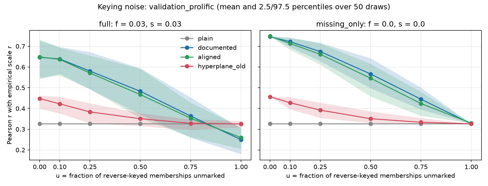

# Pooling item embeddings into scale vectors: reverse-keyed items

SynthNet ranks database scales by the cosine between pooled item embeddings.
This folder evaluates how to handle reverse-keyed items when pooling, using
the two SurveyBot3000 validation datasets, which have empirical scale-scale
correlations to score against.

## Result

Documented-sign pooling (multiply documented reverse items by -1, average unit
item vectors) is the best variant on both datasets and is equivalent to the
paper's own scale-level prediction. The hyperplane reflection method
previously used in SynthNet is markedly worse, and sign-alignment iteration
adds nothing on average but is useful as a diagnostic for items where the
model and the documentation disagree.

Pearson r with the empirical scale correlation, and sign-error rate on pairs
with |r| > .10:

| Variant | Pilot r | Pilot sign err | Validation r | Validation sign err |
|---|---|---|---|---|
| plain (keying ignored) | .23 | .36 | .33 | .41 |
| documented (B) | .87 | .07 | .75 | .20 |
| aligned (C) | .87 | .07 | .75 | .20 |
| hyperplane_old (D) | .55 | .23 | .46 | .37 |
| positive_only (E) | .64 | .20 | .57 | .31 |
| composite correlation reference | .87 | .07 | .75 | .20 |

Full tables, retrieval metrics (P@k, NDCG@10 with each scale as query) and
per-item diagnostics: `results/summary.md`.

Keying-noise simulation (`results/keying_noise/`): documented pooling degrades
roughly linearly as reverse keys go missing and stays above the hyperplane
method at every noise level; 3 % false reverse marks plus 3 % inverted scales
cost about .10 in r.



## Files

- `scale_pooling.py`: the pooling functions (numpy only), meant to be imported
  by the search engine as is. `pool_documented` is the recommended one.
- `run_pooling_comparison.py`: accuracy and retrieval comparison of all variants.
- `keying_noise_simulation.py`: robustness of each variant to corrupted keying.
- `documented_keying_noise_validation.py`: minimal demo, documented pooling only.
- `data/`: SurveyBot3000 validation data (item embeddings, respondent data,
  item to scale mapping with keying, empirical scale correlations) copied from
  `github.com/rubenarslan/surveybot3000` (`data/intermediate/`) and the
  validation-study embeddings from `github.com/synth-science/surveybot3000`.
- `results/`: summaries, small tables and figures. The multi-megabyte per-pair
  and per-draw CSVs are git-ignored and regenerated by the scripts.

## Reproduce

```
pip install -r requirements.txt
python run_pooling_comparison.py            # ~1 min
python keying_noise_simulation.py           # ~1 min
python documented_keying_noise_validation.py
```

Notes: the pilot dataset's "documented" keying was itself derived from the
empirical correlations by the SurveyBot3000 paper, so it overstates how well
any variant does with real documentation; the Prolific validation study has
documented per-item keying. The paper's scale-level prediction is a Pearson
correlation across embedding dimensions between keyed mean embedding vectors,
which is numerically the documented-cosine variant.
