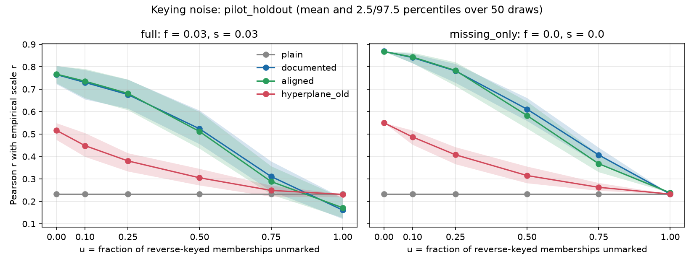

# Keying-noise simulation

See `keying_noise_simulation.py` docstring for the design. 50 draws per u and regime. Values are mean [2.5th, 97.5th percentile] over draws.

Note: the pilot's 'documented' keying is itself derived from the empirical data (see summary.md), so for the pilot the true keying is by construction consistent with the empirical correlations.

## pilot_holdout

### regime `full` (f = 0.03, s = 0.03)

| u | variant | pearson_r | mae | sign_error_rate | rho | p_at_5 | p_at_10 | ndcg_at_10 |
|---|---|---|---|---|---|---|---|---|
| 0.00 | plain | 0.233 [0.233, 0.233] | 0.212 [0.212, 0.212] | 0.363 [0.363, 0.363] | 0.345 [0.345, 0.345] | 0.566 [0.566, 0.566] | 0.465 [0.465, 0.465] | 0.745 [0.745, 0.745] |
| 0.00 | documented | 0.765 [0.723, 0.805] | 0.125 [0.119, 0.131] | 0.124 [0.108, 0.141] | 0.588 [0.570, 0.604] | 0.722 [0.708, 0.734] | 0.610 [0.598, 0.621] | 0.861 [0.854, 0.868] |
| 0.00 | aligned | 0.767 [0.727, 0.804] | 0.125 [0.118, 0.131] | 0.123 [0.107, 0.138] | 0.590 [0.575, 0.605] | 0.723 [0.712, 0.733] | 0.610 [0.600, 0.615] | 0.863 [0.857, 0.869] |
| 0.00 | hyperplane_old | 0.517 [0.475, 0.549] | 0.170 [0.165, 0.176] | 0.248 [0.231, 0.264] | 0.470 [0.453, 0.482] | 0.655 [0.643, 0.670] | 0.559 [0.547, 0.569] | 0.809 [0.801, 0.817] |
| 0.10 | plain | 0.233 [0.233, 0.233] | 0.212 [0.212, 0.212] | 0.363 [0.363, 0.363] | 0.345 [0.345, 0.345] | 0.566 [0.566, 0.566] | 0.465 [0.465, 0.465] | 0.745 [0.745, 0.745] |
| 0.10 | documented | 0.730 [0.655, 0.786] | 0.133 [0.125, 0.144] | 0.146 [0.125, 0.171] | 0.551 [0.515, 0.588] | 0.694 [0.665, 0.719] | 0.586 [0.564, 0.602] | 0.842 [0.820, 0.855] |
| 0.10 | aligned | 0.736 [0.661, 0.791] | 0.131 [0.123, 0.142] | 0.142 [0.122, 0.167] | 0.561 [0.530, 0.593] | 0.708 [0.684, 0.728] | 0.594 [0.579, 0.613] | 0.851 [0.834, 0.866] |
| 0.10 | hyperplane_old | 0.448 [0.399, 0.505] | 0.181 [0.173, 0.188] | 0.279 [0.259, 0.301] | 0.435 [0.415, 0.460] | 0.630 [0.607, 0.655] | 0.530 [0.513, 0.548] | 0.789 [0.775, 0.800] |
| 0.25 | plain | 0.233 [0.233, 0.233] | 0.212 [0.212, 0.212] | 0.363 [0.363, 0.363] | 0.345 [0.345, 0.345] | 0.566 [0.566, 0.566] | 0.465 [0.465, 0.465] | 0.745 [0.745, 0.745] |
| 0.25 | documented | 0.676 [0.614, 0.743] | 0.146 [0.136, 0.154] | 0.185 [0.159, 0.210] | 0.495 [0.474, 0.521] | 0.656 [0.630, 0.680] | 0.554 [0.536, 0.569] | 0.814 [0.795, 0.828] |
| 0.25 | aligned | 0.681 [0.607, 0.744] | 0.144 [0.133, 0.155] | 0.181 [0.150, 0.209] | 0.517 [0.484, 0.547] | 0.684 [0.653, 0.715] | 0.575 [0.555, 0.591] | 0.833 [0.814, 0.847] |
| 0.25 | hyperplane_old | 0.380 [0.334, 0.415] | 0.192 [0.187, 0.198] | 0.310 [0.294, 0.328] | 0.403 [0.382, 0.426] | 0.605 [0.580, 0.631] | 0.503 [0.478, 0.525] | 0.771 [0.755, 0.786] |
| 0.50 | plain | 0.233 [0.233, 0.233] | 0.212 [0.212, 0.212] | 0.363 [0.363, 0.363] | 0.345 [0.345, 0.345] | 0.566 [0.566, 0.566] | 0.465 [0.465, 0.465] | 0.745 [0.745, 0.745] |
| 0.50 | documented | 0.524 [0.456, 0.606] | 0.174 [0.164, 0.183] | 0.263 [0.225, 0.288] | 0.396 [0.352, 0.432] | 0.585 [0.545, 0.617] | 0.494 [0.464, 0.526] | 0.760 [0.734, 0.783] |
| 0.50 | aligned | 0.511 [0.435, 0.599] | 0.174 [0.161, 0.185] | 0.267 [0.226, 0.305] | 0.426 [0.381, 0.466] | 0.623 [0.593, 0.652] | 0.522 [0.491, 0.550] | 0.786 [0.762, 0.810] |
| 0.50 | hyperplane_old | 0.305 [0.272, 0.346] | 0.203 [0.197, 0.207] | 0.339 [0.321, 0.354] | 0.374 [0.355, 0.389] | 0.590 [0.561, 0.612] | 0.478 [0.459, 0.492] | 0.758 [0.744, 0.768] |
| 0.75 | plain | 0.233 [0.233, 0.233] | 0.212 [0.212, 0.212] | 0.363 [0.363, 0.363] | 0.345 [0.345, 0.345] | 0.566 [0.566, 0.566] | 0.465 [0.465, 0.465] | 0.745 [0.745, 0.745] |
| 0.75 | documented | 0.311 [0.246, 0.379] | 0.202 [0.195, 0.209] | 0.345 [0.322, 0.370] | 0.343 [0.319, 0.373] | 0.556 [0.527, 0.586] | 0.466 [0.444, 0.487] | 0.738 [0.720, 0.756] |
| 0.75 | aligned | 0.288 [0.230, 0.357] | 0.205 [0.196, 0.212] | 0.353 [0.325, 0.384] | 0.359 [0.328, 0.386] | 0.578 [0.546, 0.607] | 0.477 [0.453, 0.500] | 0.752 [0.734, 0.769] |
| 0.75 | hyperplane_old | 0.249 [0.222, 0.271] | 0.210 [0.208, 0.213] | 0.358 [0.349, 0.366] | 0.352 [0.341, 0.366] | 0.574 [0.559, 0.589] | 0.467 [0.458, 0.478] | 0.749 [0.740, 0.756] |
| 1.00 | plain | 0.233 [0.233, 0.233] | 0.212 [0.212, 0.212] | 0.363 [0.363, 0.363] | 0.345 [0.345, 0.345] | 0.566 [0.566, 0.566] | 0.465 [0.465, 0.465] | 0.745 [0.745, 0.745] |
| 1.00 | documented | 0.161 [0.122, 0.215] | 0.220 [0.214, 0.225] | 0.389 [0.369, 0.402] | 0.328 [0.314, 0.345] | 0.560 [0.546, 0.573] | 0.456 [0.443, 0.468] | 0.738 [0.728, 0.748] |
| 1.00 | aligned | 0.171 [0.127, 0.215] | 0.219 [0.214, 0.224] | 0.387 [0.366, 0.404] | 0.335 [0.317, 0.349] | 0.561 [0.547, 0.577] | 0.461 [0.449, 0.470] | 0.740 [0.730, 0.748] |
| 1.00 | hyperplane_old | 0.231 [0.219, 0.233] | 0.212 [0.212, 0.213] | 0.363 [0.361, 0.366] | 0.344 [0.341, 0.347] | 0.565 [0.556, 0.566] | 0.464 [0.461, 0.466] | 0.745 [0.741, 0.746] |

Variant C (aligned) restoration:

| u | restored (all corrupted) | restored (unmarked) | restored (falsely marked) | restored (inverted scale) | wrongly flipped (clean) |
|---|---|---|---|---|---|
| 0.00 | 0.302 [0.145, 0.455] | n/a | 0.678 [0.429, 0.908] | 0.007 [0.000, 0.070] | 0.018 [0.015, 0.021] |
| 0.10 | 0.448 [0.346, 0.614] | 0.638 [0.432, 0.872] | 0.671 [0.373, 0.929] | 0.017 [0.000, 0.106] | 0.018 [0.014, 0.023] |
| 0.25 | 0.473 [0.346, 0.577] | 0.562 [0.442, 0.649] | 0.655 [0.373, 0.857] | 0.016 [0.000, 0.109] | 0.021 [0.013, 0.029] |
| 0.50 | 0.348 [0.251, 0.452] | 0.341 [0.242, 0.434] | 0.668 [0.381, 0.857] | 0.049 [0.000, 0.439] | 0.033 [0.019, 0.047] |
| 0.75 | 0.183 [0.117, 0.248] | 0.141 [0.086, 0.204] | 0.644 [0.371, 0.857] | 0.046 [0.000, 0.289] | 0.045 [0.033, 0.059] |
| 1.00 | 0.098 [0.063, 0.137] | 0.047 [0.043, 0.050] | 0.598 [0.286, 0.786] | 0.001 [0.000, 0.000] | 0.001 [0.000, 0.009] |

### regime `missing_only` (f = 0.0, s = 0.0)

| u | variant | pearson_r | mae | sign_error_rate | rho | p_at_5 | p_at_10 | ndcg_at_10 |
|---|---|---|---|---|---|---|---|---|
| 0.00 | plain | 0.233 [0.233, 0.233] | 0.212 [0.212, 0.212] | 0.363 [0.363, 0.363] | 0.345 [0.345, 0.345] | 0.566 [0.566, 0.566] | 0.465 [0.465, 0.465] | 0.745 [0.745, 0.745] |
| 0.00 | documented | 0.869 [0.869, 0.869] | 0.106 [0.106, 0.106] | 0.072 [0.072, 0.072] | 0.610 [0.610, 0.610] | 0.729 [0.729, 0.729] | 0.620 [0.620, 0.620] | 0.870 [0.870, 0.870] |
| 0.00 | aligned | 0.868 [0.868, 0.868] | 0.106 [0.106, 0.106] | 0.072 [0.072, 0.072] | 0.605 [0.605, 0.605] | 0.729 [0.729, 0.729] | 0.615 [0.615, 0.615] | 0.868 [0.868, 0.868] |
| 0.00 | hyperplane_old | 0.550 [0.550, 0.550] | 0.165 [0.165, 0.165] | 0.233 [0.233, 0.233] | 0.477 [0.477, 0.477] | 0.662 [0.662, 0.662] | 0.565 [0.565, 0.565] | 0.814 [0.814, 0.814] |
| 0.10 | plain | 0.233 [0.233, 0.233] | 0.212 [0.212, 0.212] | 0.363 [0.363, 0.363] | 0.345 [0.345, 0.345] | 0.566 [0.566, 0.566] | 0.465 [0.465, 0.465] | 0.745 [0.745, 0.745] |
| 0.10 | documented | 0.841 [0.816, 0.858] | 0.113 [0.109, 0.119] | 0.091 [0.077, 0.106] | 0.575 [0.553, 0.595] | 0.705 [0.684, 0.725] | 0.598 [0.584, 0.610] | 0.851 [0.841, 0.863] |
| 0.10 | aligned | 0.843 [0.817, 0.863] | 0.112 [0.107, 0.118] | 0.089 [0.073, 0.103] | 0.579 [0.553, 0.597] | 0.714 [0.693, 0.727] | 0.601 [0.587, 0.615] | 0.857 [0.844, 0.866] |
| 0.10 | hyperplane_old | 0.487 [0.453, 0.517] | 0.176 [0.172, 0.181] | 0.264 [0.247, 0.285] | 0.442 [0.424, 0.457] | 0.637 [0.611, 0.659] | 0.539 [0.518, 0.556] | 0.794 [0.779, 0.805] |
| 0.25 | plain | 0.233 [0.233, 0.233] | 0.212 [0.212, 0.212] | 0.363 [0.363, 0.363] | 0.345 [0.345, 0.345] | 0.566 [0.566, 0.566] | 0.465 [0.465, 0.465] | 0.745 [0.745, 0.745] |
| 0.25 | documented | 0.781 [0.729, 0.813] | 0.128 [0.121, 0.138] | 0.130 [0.106, 0.161] | 0.519 [0.491, 0.548] | 0.666 [0.641, 0.688] | 0.566 [0.549, 0.581] | 0.823 [0.811, 0.835] |
| 0.25 | aligned | 0.783 [0.715, 0.821] | 0.126 [0.118, 0.139] | 0.130 [0.106, 0.163] | 0.529 [0.498, 0.566] | 0.689 [0.655, 0.711] | 0.579 [0.555, 0.597] | 0.837 [0.820, 0.848] |
| 0.25 | hyperplane_old | 0.408 [0.366, 0.442] | 0.188 [0.184, 0.194] | 0.298 [0.283, 0.317] | 0.405 [0.384, 0.429] | 0.613 [0.593, 0.640] | 0.507 [0.491, 0.529] | 0.776 [0.761, 0.792] |
| 0.50 | plain | 0.233 [0.233, 0.233] | 0.212 [0.212, 0.212] | 0.363 [0.363, 0.363] | 0.345 [0.345, 0.345] | 0.566 [0.566, 0.566] | 0.465 [0.465, 0.465] | 0.745 [0.745, 0.745] |
| 0.50 | documented | 0.611 [0.559, 0.661] | 0.161 [0.154, 0.168] | 0.224 [0.197, 0.251] | 0.419 [0.394, 0.468] | 0.602 [0.579, 0.637] | 0.510 [0.491, 0.543] | 0.774 [0.756, 0.793] |
| 0.50 | aligned | 0.583 [0.525, 0.645] | 0.163 [0.153, 0.172] | 0.231 [0.202, 0.256] | 0.440 [0.415, 0.479] | 0.633 [0.607, 0.654] | 0.531 [0.508, 0.556] | 0.794 [0.775, 0.807] |
| 0.50 | hyperplane_old | 0.315 [0.282, 0.356] | 0.202 [0.198, 0.206] | 0.335 [0.321, 0.344] | 0.372 [0.355, 0.390] | 0.589 [0.570, 0.609] | 0.480 [0.463, 0.496] | 0.759 [0.746, 0.771] |
| 0.75 | plain | 0.233 [0.233, 0.233] | 0.212 [0.212, 0.212] | 0.363 [0.363, 0.363] | 0.345 [0.345, 0.345] | 0.566 [0.566, 0.566] | 0.465 [0.465, 0.465] | 0.745 [0.745, 0.745] |
| 0.75 | documented | 0.407 [0.366, 0.440] | 0.191 [0.186, 0.195] | 0.309 [0.289, 0.326] | 0.361 [0.335, 0.390] | 0.570 [0.536, 0.605] | 0.477 [0.446, 0.500] | 0.749 [0.725, 0.764] |
| 0.75 | aligned | 0.368 [0.331, 0.411] | 0.195 [0.190, 0.200] | 0.319 [0.297, 0.334] | 0.370 [0.346, 0.396] | 0.586 [0.552, 0.614] | 0.485 [0.459, 0.504] | 0.758 [0.739, 0.775] |
| 0.75 | hyperplane_old | 0.263 [0.248, 0.283] | 0.209 [0.207, 0.211] | 0.354 [0.348, 0.360] | 0.356 [0.346, 0.367] | 0.581 [0.563, 0.598] | 0.472 [0.459, 0.485] | 0.752 [0.745, 0.763] |
| 1.00 | plain | 0.233 [0.233, 0.233] | 0.212 [0.212, 0.212] | 0.363 [0.363, 0.363] | 0.345 [0.345, 0.345] | 0.566 [0.566, 0.566] | 0.465 [0.465, 0.465] | 0.745 [0.745, 0.745] |
| 1.00 | documented | 0.233 [0.233, 0.233] | 0.212 [0.212, 0.212] | 0.363 [0.363, 0.363] | 0.345 [0.345, 0.345] | 0.566 [0.566, 0.566] | 0.465 [0.465, 0.465] | 0.745 [0.745, 0.745] |
| 1.00 | aligned | 0.238 [0.238, 0.238] | 0.212 [0.212, 0.212] | 0.362 [0.362, 0.362] | 0.342 [0.342, 0.342] | 0.561 [0.561, 0.561] | 0.463 [0.463, 0.463] | 0.742 [0.742, 0.742] |
| 1.00 | hyperplane_old | 0.233 [0.233, 0.233] | 0.212 [0.212, 0.212] | 0.363 [0.363, 0.363] | 0.345 [0.345, 0.345] | 0.566 [0.566, 0.566] | 0.465 [0.465, 0.465] | 0.745 [0.745, 0.745] |

Variant C (aligned) restoration:

| u | restored (all corrupted) | restored (unmarked) | restored (falsely marked) | restored (inverted scale) | wrongly flipped (clean) |
|---|---|---|---|---|---|
| 0.00 | n/a | n/a | n/a | n/a | 0.018 [0.018, 0.018] |
| 0.10 | 0.617 [0.462, 0.799] | 0.617 [0.462, 0.799] | n/a | n/a | 0.018 [0.017, 0.021] |
| 0.25 | 0.557 [0.375, 0.658] | 0.557 [0.375, 0.658] | n/a | n/a | 0.020 [0.015, 0.029] |
| 0.50 | 0.345 [0.219, 0.421] | 0.345 [0.219, 0.421] | n/a | n/a | 0.034 [0.020, 0.051] |
| 0.75 | 0.144 [0.098, 0.184] | 0.144 [0.098, 0.184] | n/a | n/a | 0.043 [0.032, 0.053] |
| 1.00 | 0.046 [0.046, 0.046] | 0.046 [0.046, 0.046] | n/a | n/a | 0.000 [0.000, 0.000] |

## validation_prolific

### regime `full` (f = 0.03, s = 0.03)

| u | variant | pearson_r | mae | sign_error_rate | rho | p_at_5 | p_at_10 | ndcg_at_10 |
|---|---|---|---|---|---|---|---|---|
| 0.00 | plain | 0.326 [0.326, 0.326] | 0.194 [0.194, 0.194] | 0.406 [0.406, 0.406] | 0.310 [0.310, 0.310] | 0.418 [0.418, 0.418] | 0.356 [0.356, 0.356] | 0.722 [0.722, 0.722] |
| 0.00 | documented | 0.647 [0.543, 0.728] | 0.150 [0.140, 0.158] | 0.243 [0.209, 0.265] | 0.376 [0.356, 0.395] | 0.428 [0.413, 0.440] | 0.366 [0.352, 0.378] | 0.722 [0.710, 0.733] |
| 0.00 | aligned | 0.649 [0.549, 0.732] | 0.149 [0.139, 0.156] | 0.241 [0.207, 0.267] | 0.380 [0.359, 0.398] | 0.434 [0.420, 0.445] | 0.369 [0.358, 0.378] | 0.726 [0.716, 0.734] |
| 0.00 | hyperplane_old | 0.448 [0.399, 0.462] | 0.182 [0.180, 0.186] | 0.369 [0.364, 0.381] | 0.285 [0.277, 0.296] | 0.422 [0.417, 0.425] | 0.359 [0.346, 0.361] | 0.722 [0.710, 0.726] |
| 0.10 | plain | 0.326 [0.326, 0.326] | 0.194 [0.194, 0.194] | 0.406 [0.406, 0.406] | 0.310 [0.310, 0.310] | 0.418 [0.418, 0.418] | 0.356 [0.356, 0.356] | 0.722 [0.722, 0.722] |
| 0.10 | documented | 0.639 [0.567, 0.697] | 0.153 [0.146, 0.159] | 0.257 [0.230, 0.290] | 0.357 [0.327, 0.383] | 0.427 [0.408, 0.449] | 0.365 [0.348, 0.383] | 0.719 [0.703, 0.733] |
| 0.10 | aligned | 0.636 [0.559, 0.693] | 0.152 [0.145, 0.158] | 0.256 [0.230, 0.290] | 0.360 [0.330, 0.388] | 0.429 [0.409, 0.448] | 0.364 [0.347, 0.377] | 0.720 [0.708, 0.734] |
| 0.10 | hyperplane_old | 0.422 [0.376, 0.456] | 0.185 [0.181, 0.189] | 0.378 [0.367, 0.390] | 0.290 [0.282, 0.303] | 0.418 [0.404, 0.425] | 0.359 [0.348, 0.367] | 0.721 [0.715, 0.725] |
| 0.25 | plain | 0.326 [0.326, 0.326] | 0.194 [0.194, 0.194] | 0.406 [0.406, 0.406] | 0.310 [0.310, 0.310] | 0.418 [0.418, 0.418] | 0.356 [0.356, 0.356] | 0.722 [0.722, 0.722] |
| 0.25 | documented | 0.580 [0.493, 0.672] | 0.161 [0.151, 0.171] | 0.284 [0.243, 0.324] | 0.332 [0.295, 0.361] | 0.420 [0.398, 0.440] | 0.356 [0.329, 0.372] | 0.715 [0.696, 0.734] |
| 0.25 | aligned | 0.571 [0.493, 0.655] | 0.161 [0.152, 0.170] | 0.287 [0.246, 0.328] | 0.334 [0.296, 0.375] | 0.419 [0.398, 0.439] | 0.355 [0.337, 0.371] | 0.715 [0.697, 0.733] |
| 0.25 | hyperplane_old | 0.383 [0.329, 0.425] | 0.188 [0.184, 0.193] | 0.389 [0.376, 0.402] | 0.295 [0.281, 0.307] | 0.415 [0.401, 0.425] | 0.357 [0.345, 0.368] | 0.719 [0.712, 0.725] |
| 0.50 | plain | 0.326 [0.326, 0.326] | 0.194 [0.194, 0.194] | 0.406 [0.406, 0.406] | 0.310 [0.310, 0.310] | 0.418 [0.418, 0.418] | 0.356 [0.356, 0.356] | 0.722 [0.722, 0.722] |
| 0.50 | documented | 0.483 [0.371, 0.594] | 0.174 [0.164, 0.184] | 0.337 [0.294, 0.375] | 0.287 [0.252, 0.329] | 0.408 [0.383, 0.432] | 0.344 [0.319, 0.366] | 0.704 [0.678, 0.725] |
| 0.50 | aligned | 0.467 [0.353, 0.591] | 0.175 [0.163, 0.184] | 0.341 [0.302, 0.380] | 0.291 [0.253, 0.331] | 0.406 [0.381, 0.430] | 0.342 [0.318, 0.363] | 0.703 [0.678, 0.723] |
| 0.50 | hyperplane_old | 0.351 [0.315, 0.377] | 0.191 [0.189, 0.194] | 0.399 [0.388, 0.408] | 0.302 [0.290, 0.311] | 0.418 [0.410, 0.425] | 0.358 [0.348, 0.368] | 0.719 [0.713, 0.725] |
| 0.75 | plain | 0.326 [0.326, 0.326] | 0.194 [0.194, 0.194] | 0.406 [0.406, 0.406] | 0.310 [0.310, 0.310] | 0.418 [0.418, 0.418] | 0.356 [0.356, 0.356] | 0.722 [0.722, 0.722] |
| 0.75 | documented | 0.363 [0.259, 0.453] | 0.188 [0.179, 0.195] | 0.387 [0.354, 0.415] | 0.276 [0.242, 0.311] | 0.407 [0.386, 0.430] | 0.343 [0.316, 0.369] | 0.702 [0.677, 0.723] |
| 0.75 | aligned | 0.353 [0.262, 0.428] | 0.188 [0.180, 0.194] | 0.391 [0.360, 0.419] | 0.285 [0.251, 0.322] | 0.405 [0.385, 0.427] | 0.342 [0.322, 0.362] | 0.702 [0.680, 0.721] |
| 0.75 | hyperplane_old | 0.328 [0.297, 0.347] | 0.194 [0.192, 0.196] | 0.405 [0.397, 0.411] | 0.307 [0.298, 0.314] | 0.418 [0.413, 0.424] | 0.356 [0.347, 0.362] | 0.720 [0.712, 0.723] |
| 1.00 | plain | 0.326 [0.326, 0.326] | 0.194 [0.194, 0.194] | 0.406 [0.406, 0.406] | 0.310 [0.310, 0.310] | 0.418 [0.418, 0.418] | 0.356 [0.356, 0.356] | 0.722 [0.722, 0.722] |
| 1.00 | documented | 0.250 [0.180, 0.304] | 0.199 [0.195, 0.205] | 0.423 [0.405, 0.446] | 0.297 [0.273, 0.315] | 0.410 [0.400, 0.422] | 0.347 [0.334, 0.358] | 0.710 [0.695, 0.722] |
| 1.00 | aligned | 0.260 [0.205, 0.310] | 0.198 [0.194, 0.203] | 0.424 [0.403, 0.445] | 0.299 [0.276, 0.314] | 0.406 [0.396, 0.415] | 0.346 [0.331, 0.355] | 0.711 [0.698, 0.723] |
| 1.00 | hyperplane_old | 0.326 [0.309, 0.340] | 0.194 [0.193, 0.195] | 0.407 [0.404, 0.410] | 0.309 [0.304, 0.314] | 0.417 [0.416, 0.418] | 0.356 [0.353, 0.357] | 0.722 [0.721, 0.722] |

Variant C (aligned) restoration:

| u | restored (all corrupted) | restored (unmarked) | restored (falsely marked) | restored (inverted scale) | wrongly flipped (clean) |
|---|---|---|---|---|---|
| 0.00 | 0.290 [0.099, 0.467] | n/a | 0.570 [0.333, 0.853] | 0.009 [0.000, 0.089] | 0.011 [0.006, 0.025] |
| 0.10 | 0.300 [0.170, 0.454] | 0.266 [0.000, 0.613] | 0.559 [0.247, 0.778] | 0.001 [0.000, 0.000] | 0.014 [0.006, 0.023] |
| 0.25 | 0.245 [0.137, 0.351] | 0.167 [0.051, 0.350] | 0.571 [0.333, 0.772] | 0.016 [0.000, 0.263] | 0.019 [0.006, 0.029] |
| 0.50 | 0.156 [0.069, 0.258] | 0.069 [0.006, 0.166] | 0.584 [0.153, 0.889] | 0.012 [0.000, 0.139] | 0.023 [0.012, 0.035] |
| 0.75 | 0.131 [0.066, 0.242] | 0.039 [0.000, 0.074] | 0.614 [0.228, 1.000] | 0.034 [0.000, 0.246] | 0.021 [0.010, 0.032] |
| 1.00 | 0.096 [0.045, 0.167] | 0.024 [0.000, 0.028] | 0.584 [0.269, 0.886] | 0.000 [0.000, 0.000] | 0.004 [0.004, 0.007] |

### regime `missing_only` (f = 0.0, s = 0.0)

| u | variant | pearson_r | mae | sign_error_rate | rho | p_at_5 | p_at_10 | ndcg_at_10 |
|---|---|---|---|---|---|---|---|---|
| 0.00 | plain | 0.326 [0.326, 0.326] | 0.194 [0.194, 0.194] | 0.406 [0.406, 0.406] | 0.310 [0.310, 0.310] | 0.418 [0.418, 0.418] | 0.356 [0.356, 0.356] | 0.722 [0.722, 0.722] |
| 0.00 | documented | 0.746 [0.746, 0.746] | 0.137 [0.137, 0.137] | 0.204 [0.204, 0.204] | 0.391 [0.391, 0.391] | 0.438 [0.438, 0.438] | 0.376 [0.376, 0.376] | 0.730 [0.730, 0.730] |
| 0.00 | aligned | 0.749 [0.749, 0.749] | 0.136 [0.136, 0.136] | 0.200 [0.200, 0.200] | 0.394 [0.394, 0.394] | 0.442 [0.443, 0.443] | 0.376 [0.376, 0.376] | 0.732 [0.732, 0.732] |
| 0.00 | hyperplane_old | 0.457 [0.457, 0.457] | 0.181 [0.181, 0.181] | 0.367 [0.367, 0.367] | 0.285 [0.285, 0.285] | 0.422 [0.423, 0.423] | 0.360 [0.360, 0.360] | 0.723 [0.723, 0.723] |
| 0.10 | plain | 0.326 [0.326, 0.326] | 0.194 [0.194, 0.194] | 0.406 [0.406, 0.406] | 0.310 [0.310, 0.310] | 0.418 [0.418, 0.418] | 0.356 [0.356, 0.356] | 0.722 [0.722, 0.722] |
| 0.10 | documented | 0.722 [0.696, 0.740] | 0.142 [0.139, 0.145] | 0.220 [0.206, 0.233] | 0.372 [0.347, 0.393] | 0.434 [0.421, 0.445] | 0.375 [0.364, 0.385] | 0.727 [0.713, 0.741] |
| 0.10 | aligned | 0.714 [0.683, 0.743] | 0.142 [0.138, 0.147] | 0.219 [0.205, 0.234] | 0.368 [0.329, 0.394] | 0.433 [0.418, 0.444] | 0.369 [0.354, 0.382] | 0.724 [0.708, 0.739] |
| 0.10 | hyperplane_old | 0.428 [0.396, 0.454] | 0.184 [0.182, 0.187] | 0.376 [0.368, 0.387] | 0.288 [0.278, 0.299] | 0.418 [0.405, 0.429] | 0.360 [0.348, 0.368] | 0.721 [0.717, 0.726] |
| 0.25 | plain | 0.326 [0.326, 0.326] | 0.194 [0.194, 0.194] | 0.406 [0.406, 0.406] | 0.310 [0.310, 0.310] | 0.418 [0.418, 0.418] | 0.356 [0.356, 0.356] | 0.722 [0.722, 0.722] |
| 0.25 | documented | 0.675 [0.628, 0.717] | 0.150 [0.144, 0.156] | 0.247 [0.218, 0.276] | 0.342 [0.304, 0.374] | 0.432 [0.409, 0.449] | 0.367 [0.352, 0.383] | 0.721 [0.701, 0.741] |
| 0.25 | aligned | 0.661 [0.611, 0.714] | 0.151 [0.143, 0.157] | 0.249 [0.218, 0.278] | 0.340 [0.302, 0.382] | 0.427 [0.406, 0.444] | 0.362 [0.344, 0.379] | 0.717 [0.696, 0.739] |
| 0.25 | hyperplane_old | 0.392 [0.355, 0.428] | 0.188 [0.184, 0.191] | 0.388 [0.375, 0.402] | 0.295 [0.283, 0.307] | 0.416 [0.406, 0.425] | 0.358 [0.343, 0.367] | 0.719 [0.715, 0.725] |
| 0.50 | plain | 0.326 [0.326, 0.326] | 0.194 [0.194, 0.194] | 0.406 [0.406, 0.406] | 0.310 [0.310, 0.310] | 0.418 [0.418, 0.418] | 0.356 [0.356, 0.356] | 0.722 [0.722, 0.722] |
| 0.50 | documented | 0.566 [0.498, 0.642] | 0.166 [0.158, 0.174] | 0.309 [0.264, 0.345] | 0.296 [0.253, 0.327] | 0.420 [0.405, 0.441] | 0.354 [0.334, 0.373] | 0.710 [0.687, 0.729] |
| 0.50 | aligned | 0.546 [0.458, 0.615] | 0.168 [0.160, 0.177] | 0.316 [0.274, 0.349] | 0.301 [0.265, 0.329] | 0.414 [0.395, 0.429] | 0.349 [0.335, 0.365] | 0.708 [0.688, 0.723] |
| 0.50 | hyperplane_old | 0.351 [0.329, 0.386] | 0.192 [0.188, 0.194] | 0.400 [0.387, 0.406] | 0.303 [0.293, 0.311] | 0.417 [0.408, 0.422] | 0.357 [0.348, 0.366] | 0.719 [0.715, 0.723] |
| 0.75 | plain | 0.326 [0.326, 0.326] | 0.194 [0.194, 0.194] | 0.406 [0.406, 0.406] | 0.310 [0.310, 0.310] | 0.418 [0.418, 0.418] | 0.356 [0.356, 0.356] | 0.722 [0.722, 0.722] |
| 0.75 | documented | 0.445 [0.395, 0.501] | 0.181 [0.176, 0.185] | 0.366 [0.341, 0.387] | 0.285 [0.250, 0.317] | 0.415 [0.395, 0.434] | 0.349 [0.334, 0.366] | 0.710 [0.689, 0.728] |
| 0.75 | aligned | 0.424 [0.364, 0.480] | 0.182 [0.177, 0.188] | 0.371 [0.349, 0.394] | 0.290 [0.247, 0.315] | 0.409 [0.390, 0.428] | 0.345 [0.330, 0.360] | 0.707 [0.685, 0.720] |
| 0.75 | hyperplane_old | 0.334 [0.326, 0.354] | 0.193 [0.191, 0.194] | 0.404 [0.395, 0.407] | 0.308 [0.301, 0.311] | 0.418 [0.412, 0.422] | 0.357 [0.352, 0.362] | 0.721 [0.717, 0.722] |
| 1.00 | plain | 0.326 [0.326, 0.326] | 0.194 [0.194, 0.194] | 0.406 [0.406, 0.406] | 0.310 [0.310, 0.310] | 0.418 [0.418, 0.418] | 0.356 [0.356, 0.356] | 0.722 [0.722, 0.722] |
| 1.00 | documented | 0.326 [0.326, 0.326] | 0.194 [0.194, 0.194] | 0.406 [0.406, 0.406] | 0.310 [0.310, 0.310] | 0.418 [0.418, 0.418] | 0.356 [0.356, 0.356] | 0.722 [0.722, 0.722] |
| 1.00 | aligned | 0.329 [0.329, 0.329] | 0.193 [0.193, 0.193] | 0.408 [0.408, 0.408] | 0.306 [0.306, 0.306] | 0.410 [0.410, 0.410] | 0.351 [0.351, 0.351] | 0.718 [0.718, 0.718] |
| 1.00 | hyperplane_old | 0.326 [0.326, 0.326] | 0.194 [0.194, 0.194] | 0.406 [0.406, 0.406] | 0.310 [0.310, 0.310] | 0.418 [0.418, 0.418] | 0.356 [0.356, 0.356] | 0.722 [0.722, 0.722] |

Variant C (aligned) restoration:

| u | restored (all corrupted) | restored (unmarked) | restored (falsely marked) | restored (inverted scale) | wrongly flipped (clean) |
|---|---|---|---|---|---|
| 0.00 | n/a | n/a | n/a | n/a | 0.011 [0.011, 0.011] |
| 0.10 | 0.245 [0.000, 0.500] | 0.245 [0.000, 0.500] | n/a | n/a | 0.017 [0.006, 0.025] |
| 0.25 | 0.156 [0.050, 0.300] | 0.156 [0.050, 0.300] | n/a | n/a | 0.019 [0.006, 0.028] |
| 0.50 | 0.082 [0.006, 0.148] | 0.082 [0.006, 0.148] | n/a | n/a | 0.021 [0.012, 0.033] |
| 0.75 | 0.038 [0.004, 0.069] | 0.038 [0.004, 0.069] | n/a | n/a | 0.019 [0.010, 0.031] |
| 1.00 | 0.026 [0.026, 0.026] | 0.026 [0.026, 0.026] | n/a | n/a | 0.003 [0.003, 0.003] |

